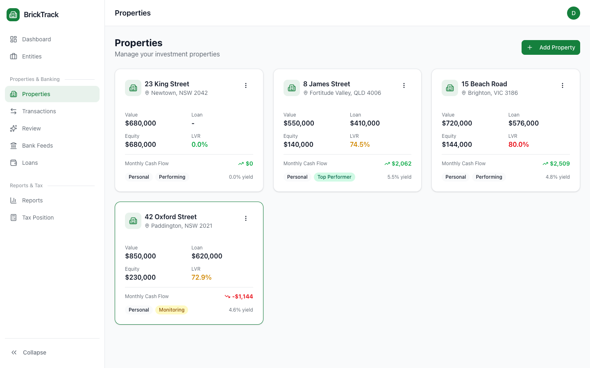
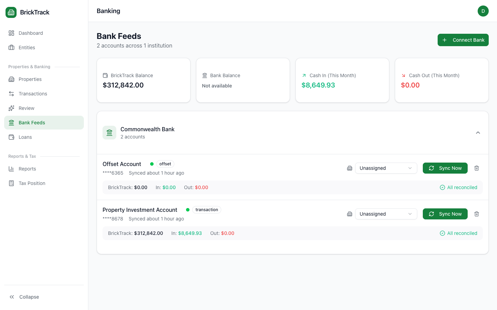
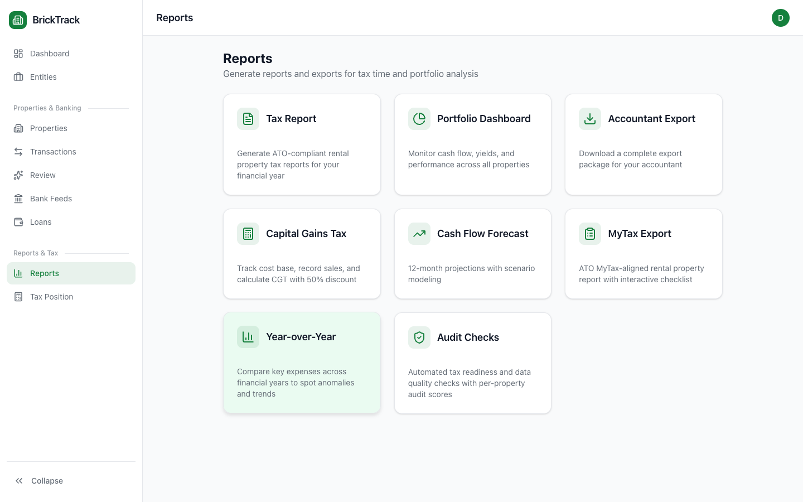
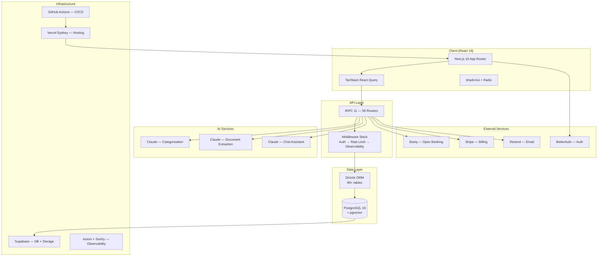
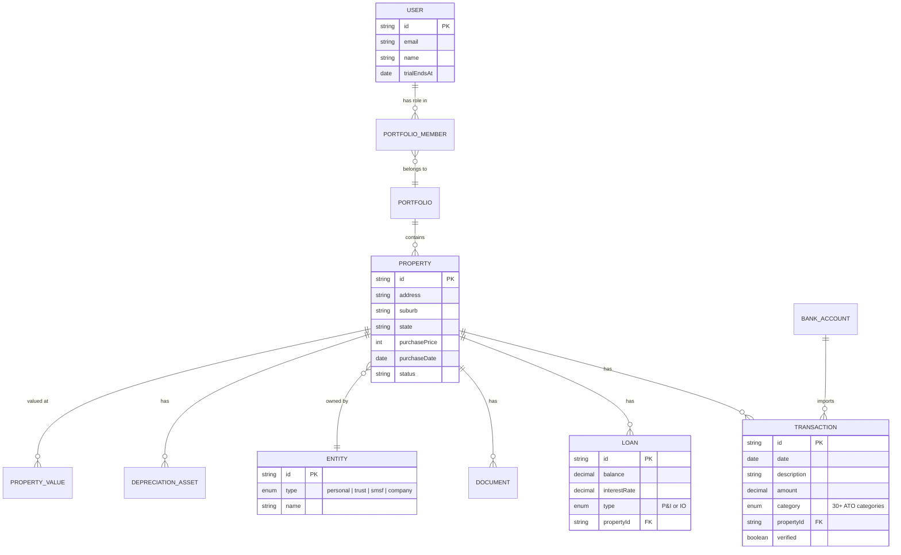
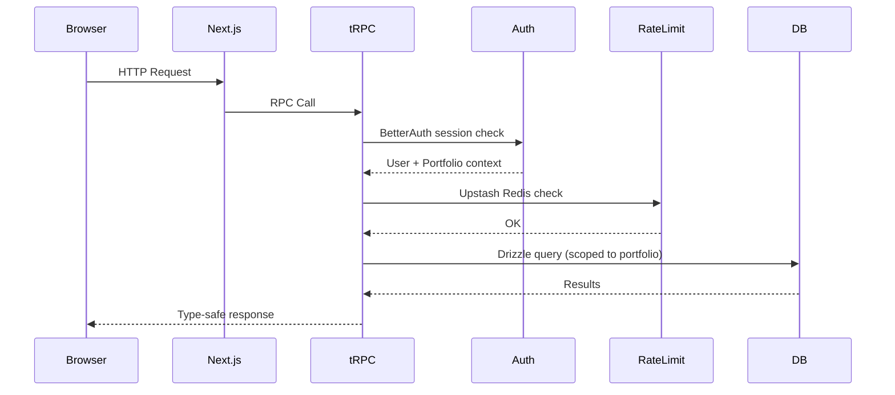

# BrickTrack

**Australian property investment tracking platform** - automates bank feeds, categorises transactions with AI, and generates ATO-ready tax reports.

[](https://github.com/ItsMattG/property-tracker/actions)
[](https://www.typescriptlang.org/)
[](https://nextjs.org/)

**Live:** [bricktrack.au](https://bricktrack.au) | **Staging:** [staging.bricktrack.au](https://staging.bricktrack.au)

---

## The Problem

Australian property investors spend hours each month in spreadsheets categorising rental income, expenses, and loan payments for tax time. Most end up paying accountants $500+ to sort through bank statements, or they miss legitimate deductions entirely.

Existing tools like PropertyMe are built for property managers (not investors), and generic accounting software like Xero doesn't understand Australian rental property tax categories (ATO Schedule E deductions, negative gearing, CGT cost base tracking).

**BrickTrack connects directly to your bank, auto-categorises every transaction to the correct ATO tax category using AI, and generates reports your accountant can use directly at tax time.**

---

## Screenshots

<p align="center">
  
  <br/>
  <em>Dashboard with portfolio summary, cash flow chart, equity projections, property map, and rental yield breakdown</em>
</p>

<p align="center">
  
  <br/>
  <em>Property cards showing value, loan, equity, LVR, monthly cash flow, and performance tags</em>
</p>

<p align="center">
  
  <br/>
  <em>AI-categorised transactions with ATO tax categories, property allocation, and verification status</em>
</p>

<p align="center">
  
  <br/>
  <em>Open Banking integration - automatic daily sync from 100+ Australian banks via CDR</em>
</p>

<p align="center">
  
  <br/>
  <em>8 report types: Tax Report, Portfolio Dashboard, Accountant Export, CGT, Cash Flow Forecast, MyTax, YoY, Audit Checks</em>
</p>

---

## Architecture

### System Overview



### Data Model (Key Entities)



### Request Lifecycle



---

## Key Design Decisions

These are the architectural trade-offs I evaluated and the reasoning behind each choice.

| Decision | Chose | Over | Rationale |
|----------|-------|------|-----------|
| **API layer** | tRPC 11 | REST / GraphQL | End-to-end type safety from DB to UI. No schema drift, no codegen, auto-generated client. 56 domain routers stay organised with zero boilerplate |
| **ORM** | Drizzle | Prisma | Faster migrations, smaller bundle, SQL-like syntax. Schema-as-code means the 80+ table schema (3,400 LOC) is the source of truth |
| **Auth** | BetterAuth | Clerk | Migrated from Clerk to reduce vendor dependency and monthly costs. BetterAuth runs in-process with Drizzle adapter, supports Google OAuth + email/password, and gives full control over session management |
| **Banking** | Basiq (CDR) | Plaid / manual CSV | Only open banking provider with 100+ Australian banks via Consumer Data Right. Handles OAuth consent flow and daily transaction sync |
| **AI** | Claude (Anthropic) | GPT-4 | Superior accuracy for Australian tax categorisation. Handles 30+ ATO Schedule E categories. Also powers document extraction (settlement statements, depreciation schedules) and a chat assistant |
| **Hosting region** | Vercel Sydney | US regions | <50ms latency for Australian users. Native Next.js optimisation with edge middleware |
| **Analytics** | Vercel Analytics | Google Analytics | No cookie banners needed, GDPR-compliant by default, integrated with deployment platform |
| **Database** | PostgreSQL + pgvector | MongoDB / MySQL | Relational integrity for financial data, pgvector for property similarity embeddings, Supabase for managed hosting with daily backups |
| **Rate limiting** | Upstash Redis | In-memory | Serverless-compatible (no persistent connections), works across Vercel function instances |
| **Payments** | Stripe | Paddle / LemonSqueezy | Most mature API, Australian bank support, handles GST/tax invoicing |

---

## Tech Stack

### Frontend
- **Next.js 16** (App Router) with **React 19** and **TypeScript 5** (strict mode)
- **Tailwind CSS 4** with **shadcn/ui** (Radix primitives)
- **TanStack React Query** via tRPC for server state
- **React Hook Form** + **Zod 4** for validation
- **Recharts** for data visualisation
- **next-themes** for dark mode

### Backend
- **tRPC 11** — 56 domain routers, 7 procedure types (public, protected, write, member, bank, pro, team)
- **Drizzle ORM** — 80+ tables, 50+ enums, type-safe schema
- **PostgreSQL 16** with pgvector on Supabase
- **BetterAuth** — email/password + Google OAuth, Drizzle adapter, 5-min session cache
- **Upstash Redis** — rate limiting middleware

### AI Services (Anthropic Claude)
- **Transaction categorisation** — maps bank transactions to 30+ ATO tax categories
- **Document extraction** — settlement statements, depreciation schedules, receipts (vision API)
- **Chat assistant** — streaming AI chat with portfolio context and tool use
- **Listing extraction** — scrapes property details from URLs

### External Integrations
| Service | Purpose |
|---------|---------|
| [Basiq](https://basiq.io) | CDR-compliant open banking (100+ AU banks) |
| [Stripe](https://stripe.com) | Subscriptions (Free / Pro $14/mo / Team $29/mo) |
| [Resend](https://resend.com) | Transactional email + password reset |
| [Supabase](https://supabase.com) | Database hosting + document storage |
| [Axiom](https://axiom.co) | Structured logging + metrics |
| [Sentry](https://sentry.io) | Error tracking |
| [Vercel](https://vercel.com) | Hosting (Sydney region) + analytics |

### Infrastructure
- **CI/CD:** GitHub Actions (lint, typecheck, unit tests, build, E2E on 4 shards, Lighthouse audit)
- **Deployment:** `develop` auto-deploys to staging, `main` auto-deploys to production
- **Monitoring:** 18 cron jobs (bank sync, email sync, uptime checks, anomaly detection, trial reminders)
- **Backups:** Daily pg_dump via GitHub Actions, 90-day retention

---

## Features

### Core
- **Property portfolio** — track properties with purchase details, valuations, equity, LVR, cash flow, and performance tags
- **Automatic bank feeds** — daily sync from 100+ Australian banks via CDR open banking
- **AI categorisation** — Claude maps every transaction to the correct ATO tax category
- **Tax reports** — ATO-compliant rental property tax report, MyTax export, accountant export package
- **Settlement capture** — upload settlement statements, AI extracts cost base for CGT
- **Rental yield** — gross and net yield calculations per property and portfolio-wide

### Reports
- **Tax Report** — ATO Schedule E rental property tax report
- **Portfolio Dashboard** — cash flow, yields, and performance across all properties
- **Capital Gains Tax** — cost base tracking, 50% CGT discount calculation
- **Cash Flow Forecast** — 12-month projections with scenario modelling
- **MyTax Export** — ATO MyTax-aligned report with interactive checklist
- **Year-over-Year** — compare expenses across financial years to spot anomalies
- **Audit Checks** — automated tax readiness and data quality scoring
- **Accountant Export** — complete export package for your accountant

### Advanced
- **Multi-entity** — personal, trust, company, and SMSF ownership structures
- **AI chat** — ask questions about your portfolio in natural language
- **Team collaboration** — invite accountants or partners with role-based access (owner, partner, accountant, advisor)
- **Scenario modelling** — "what-if" analysis for investment decisions
- **Gmail integration** — forward receipts/invoices, AI matches to properties
- **Notifications** — push notifications for rent received, sync failures, anomalies
- **Referral program** — invite friends for free months

---

## Development Workflow

This project is built almost entirely with AI-assisted development using [Claude Code](https://claude.com/claude-code). Here's how the workflow operates:

### AI-Assisted Development Process

1. **Task selection** — persistent task management via [Beads](https://github.com/beads-cli/beads) tracks priorities, dependencies, and progress across sessions
2. **Worktree isolation** — every feature gets its own git worktree, enabling parallel Claude Code sessions without branch conflicts
3. **TDD with AI** — tests are written first (Vitest unit + Playwright E2E), then implementation is guided by the test suite
4. **Structured implementation** — complex features use a brainstorm &rarr; plan &rarr; implement &rarr; verify &rarr; review pipeline
5. **Automated review** — 4 parallel review agents score code changes against project conventions, then CI runs lint, typecheck, unit tests, build, 4-shard E2E, and Lighthouse audit
6. **Branch model** — feature branches &rarr; `develop` (staging) &rarr; `main` (production) with automated deploys

### What This Demonstrates

- **Prompt engineering** — extensive `CLAUDE.md` instructions (project conventions, anti-patterns, architecture decisions) ensure consistent AI output across sessions
- **Context management** — pattern docs, component references, and server-layer quick-references give AI agents the right context without re-explaining
- **Quality gates** — TDD + E2E + code review + CI pipeline catches issues before they reach staging
- **Velocity** — 4 complete roadmap versions (v0.1-v0.4) with 80+ tables, 56 routers, 106 unit test files, and 29 E2E spec files

---

## Testing

### Unit Tests (Vitest)
- **106 test files** across `src/`
- Coverage thresholds: 40% statements/functions/lines, 30% branches
- v8 coverage provider with PR comments in CI

### E2E Tests (Playwright)
- **29 spec files** across public, authenticated, core-loop, and UI audit suites
- Runs on **4 parallel shards** against staging in CI
- BetterAuth session reuse across tests
- Accessibility testing via axe-core

### CI Pipeline
```
lint → typecheck → unit tests → build → E2E (4 shards) → Lighthouse audit
```

---

## Project Structure

```
bricktrack/
├── src/
│   ├── app/                    # Next.js App Router (90+ pages)
│   │   ├── (auth)/             # Sign-in, sign-up, forgot-password
│   │   ├── (dashboard)/        # Protected routes
│   │   ├── api/                # tRPC handler, webhooks, 18 cron jobs
│   │   └── blog/               # SEO content pages
│   ├── components/             # React components by feature
│   │   ├── ui/                 # shadcn/ui primitives
│   │   ├── dashboard/          # Portfolio overview widgets
│   │   ├── properties/         # Property CRUD, detail views
│   │   ├── transactions/       # Transaction list, categorisation
│   │   └── reports/            # Tax reports, exports
│   ├── server/
│   │   ├── db/schema.ts        # Drizzle schema (80+ tables, 3,400 LOC)
│   │   ├── routers/            # 56 tRPC domain routers
│   │   ├── services/           # External API integrations
│   │   └── middleware/         # Auth, rate limiting, observability
│   ├── lib/                    # Auth config, tRPC client, utilities
│   └── hooks/                  # Custom React hooks
├── e2e/                        # 29 Playwright E2E specs
├── mobile/                     # React Native (Expo) app
├── .github/workflows/          # CI/CD + database backups
└── docs/                       # Architecture docs + design plans
```

---

## Local Development

### Prerequisites
- Node 20+, pnpm 10+, Docker

### Quick Start

```bash
# Start PostgreSQL
docker compose up -d

# Create database + push schema
docker compose exec db psql -U postgres -c "CREATE DATABASE bricktrack;"
npx drizzle-kit push

# Install dependencies + start dev server
pnpm install
pnpm dev
```

### Environment Variables

Copy `.env.example` to `.env.local` and configure:
- `DATABASE_URL` — PostgreSQL connection string
- `BETTER_AUTH_SECRET` — session encryption key
- `GOOGLE_CLIENT_ID` / `GOOGLE_CLIENT_SECRET` — Google OAuth
- `ANTHROPIC_API_KEY` — AI categorisation + chat
- `BASIQ_API_KEY` — open banking
- `STRIPE_SECRET_KEY` — billing
- Plus: Resend, Supabase, Axiom, Sentry, Upstash Redis

### Commands

| Command | Description |
|---------|-------------|
| `pnpm dev` | Start development server |
| `pnpm build` | Production build |
| `pnpm test:unit` | Run Vitest unit tests |
| `pnpm test:e2e` | Run Playwright E2E tests |
| `pnpm db:studio` | Open Drizzle Studio GUI |
| `docker compose up -d` | Start local PostgreSQL |
| `docker compose down -v` | Reset database |

---

## Subscription Tiers

| | Free | Pro ($14/mo) | Team ($29/mo) |
|---|:---:|:---:|:---:|
| Properties | 1 | Unlimited | Unlimited |
| Bank connections | 1 | Unlimited | Unlimited |
| Tax reports | Basic | Full suite | Full suite |
| AI categorisation | Limited | Unlimited | Unlimited |
| AI chat | - | Unlimited | Unlimited |
| Team members | - | - | Up to 5 |

---

## Roadmap

### V0.4 (Current - 14/15 complete)
Stripe billing, blog SEO pipeline, PostHog analytics, conversion prompts, rental yield calculator, security hardening, settlement statement capture, depreciation schedules, sitemap, dynamic OG images, CI/CD pipeline, monitoring/alerting, Gmail OAuth integration, database backups

### Previous Releases
| Version | Highlights |
|---------|------------|
| **V0.3** | Landing page, AI chat, onboarding flow, support tickets, referral program, task management, email integration, TaxTank-inspired features, audit checks, YoY comparison |
| **V0.2** | Scenario modelling, portfolio sharing, trust/SMSF compliance, tax position calculator, performance benchmarking, similar properties |
| **V0.1** | Core platform, PropertyMe import, mobile app (React Native), compliance checks, milestone tracking |

---

## License

Proprietary software. All rights reserved.

---

<p align="center">
  Built for Australian property investors<br/>
  Melbourne, Australia
</p>
